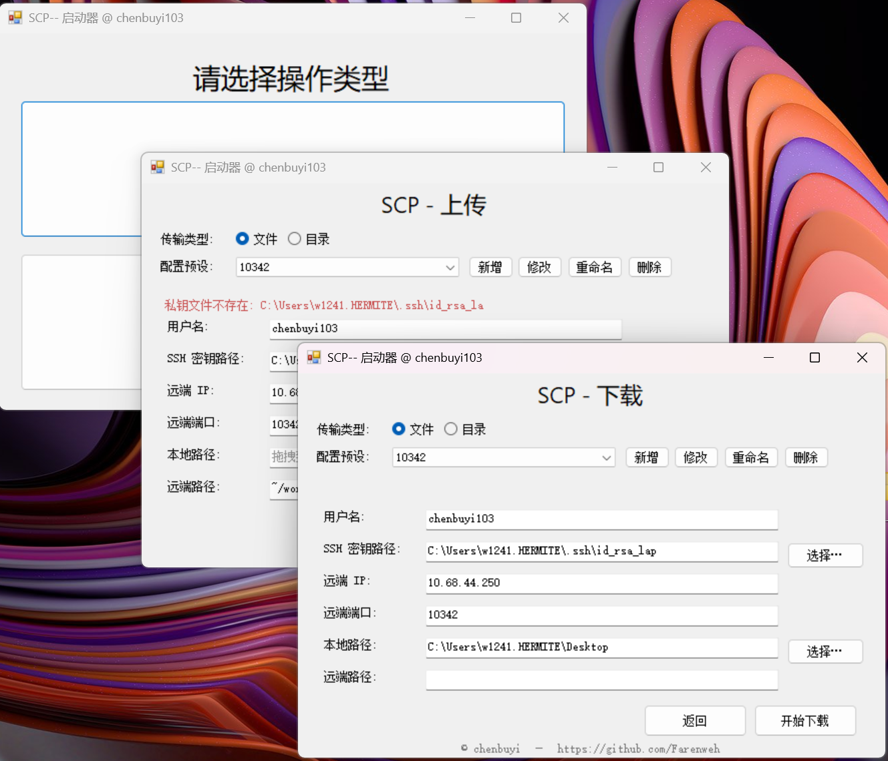

OUTDATED

# SCP--：Win SCP 懒狗GUI工具

一个运行于Windows的单文件portable 图形化 SCP 启动工具，用于解决懒得输入SCP命令和vscode传输慢没有进度条的问题，为懒狗长期使用而设计。

## 功能特性
- ⚡ **懒狗友好**：一次修改打包，终生默认使用：通过修改预设配置快速执行传输任务
- 🚀 **简洁界面**：直观的图形化用户界面
- 📁 **文件/目录传输**：支持单文件和整个目录的上传下载
- 🔐 **SSH 密钥认证**：使用 SSH 私钥进行安全连接
- 🎯 **双向传输**：支持上传到远程服务器和从远程服务器下载

启动后可以自动填写以下内容：


## 使用要求

- Windows 操作系统
- openssh

## 重打包要求

- Pyqt6
- Pyinstaller

## 使用说明

### 首次部署

1. **配置默认值**：编辑 `scp--.py` 文件中的 `DEFAULTS` 字典，设置你的默认参数：
   ```python
   DEFAULTS = {
       "username": "your_username",
       "ip": "your_server_ip",
       "port": "22",
       "key": r"C:\path\to\your\private_key",
       "download_local": r"C:\your\download\path",
       "upload_remote": "~/workspace",
   }
   ```

2. **打包为StandAlone程序包**
    安装pyqt和pyinstaller（执行`pip install -r requirements.txt`）
    执行compile.bat或compile.sh，在dist中找到打包后程序

## 配置说明

### SSH 密钥设置

程序使用 SSH 私钥进行身份验证，请确保：

1. 你有对应服务器的 SSH 私钥文件
2. 私钥文件路径正确
3. 服务器已配置相应的公钥

### 默认配置

- **用户名**：SSH 连接用户名
- **IP 地址**：远程服务器 IP
- **端口**：SSH 连接端口（默认 22）
- **私钥路径**：SSH 私钥文件的完整路径
- **本地路径**：默认的本地文件保存位置
- **远程路径**：默认的远程目录路径

## 注意事项

- 传输过程会在新的命令行窗口中执行
- 传输开始后，"开始传输"按钮会被锁定 3 秒，防止重复点击
- 请确保 SSH 连接信息正确，否则传输会失败
- 对于大文件传输，请耐心等待传输完成

## 开发者信息

- **作者**：chenbuyi
- **GitHub**：https://github.com/Farenweh
- **版本**：基于 PyQt6 的 Windows 版本

## 许可证

此项目仅供个人学习和使用。

---

💡 **提示**：如果你觉得这个工具有用，欢迎 star 本项目！
